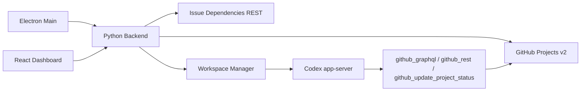

# Architecture

GitHub Symphony 是本地运行的 Codex 编排器。它不是 durable workflow engine；权威状态来自 GitHub Projects v2 和本地工作区。

## Runtime Flow

## Backend Layers

- `core`：不认识 GitHub 细节，只处理配置、prompt、事件、工作区、runner 和调度。
- `integrations.github`：把 Projects v2 item 归一化成 `WorkItem`，并实现 GitHub 动态工具。
- `codex`：封装 app-server JSON-RPC stdio 协议。
- `api`：向桌面端暴露本地 HTTP 控制面。

## Dispatch Rules

调度器每轮执行：

1. 刷新运行中任务状态。
2. 读取 active states 中的 Project items。
3. 丢弃不在 `tracker.repositories` allowlist 内的仓库，避免多仓库 Project 派发到未授权仓库。
4. 按 priority、created_at、identifier 排序。
5. 跳过 running/claimed、terminal、配置为 blocked states 且存在未完成依赖、超过并发槽的任务。
6. 为可派发任务创建 runner。

## Workspace Checkout

每个 `WorkItem` 会映射到 `workspace.root` 下的隔离目录，Codex app-server 的 `cwd` 始终是这个 per-item workspace。首次创建工作区时，`workspace.checkout.mode=clone` 会按当前 item 的 `repository` 生成 clone URL 并把仓库 checkout 到配置的 `path`，默认是 `git@github.com:owner/repo.git` 到 `.`。`protocol`、`depth` 和 `workspace.checkout.repositories` 可覆盖协议、浅克隆深度、单仓库 `clone_url`、`branch` 与 `path`。

`workspace.hooks.after_create` 保留为 checkout 后的扩展 hook，用于安装依赖、准备本地配置或执行高级自定义流程。旧 WORKFLOW 如果只配置了 `after_create` 而没有 `workspace.checkout`，配置层会把 checkout mode 归一化为 `hook`，保持历史 hook-only 行为。

## Status Policy

GitHub Project 的 `Status` single-select 选项可以完全自定义。配置层把状态分成四类：

- `active_states`：允许调度器派发给 Codex agent 的阶段。
- `handoff_states`：成功运行后可交接给人工或外部流程的阶段，不会继续派发，也不视为终态清理。
- `terminal_states`：真正结束的阶段，供未来 workspace 清理和终态判断使用。
- `blocker_policy.blocked_states`：只有这些阶段会因为 GitHub issue dependencies 的未完成依赖而暂停派发。

默认 Autonomy preset 是 `PR 前全自动`：`Todo`、`In Progress`、`Rework` 和 `Merging` 属于 active states；`Human Review` 是人工交接阶段；`Done`、`Closed`、`Cancelled` 是终态。`completion_policy.success_state` 的语义是成功 turn 后的目标/交接阶段，可以是 `Human Review`、`Ready for QA`、`Done` 或任意非 active 状态。

默认 `completion_policy.kind=agent_managed`，调度器不会在成功 turn 后自动写完成状态；prompt 会要求 agent 使用 GitHub 工具在 PR 前置门禁满足后把任务移到 `Human Review`。如果用户切回 `update_project_status`，App 会自动更新 Project item 的 `Status` 到目标状态，目标状态不能仍处于 active states。

## Autonomy Boundary

GitHub Symphony 不把 `commit`、`push`、`merge` 做成 orchestrator 内置业务动作。PR 前自治由 Codex agent 在隔离工作区中根据 prompt 执行，并受以下边界共同约束：

- `approval_policy`：新 settings 默认使用 `high-trust` preset 并归一化为 app-server 的 `never`；已有 settings 缺少该字段时仍保守拒绝。高信任模式会自动批准 command、file、permissions、applyPatch、exec approval，并为工具 user-input 选择可继续项，只应配合隔离工作区、受限 token 和可信 prompt 使用。
- `tools.github.mode`：`read_only` 会拒绝 GitHub 写操作；`read_write` 才允许 GraphQL mutation、仓库 allowlist 内 REST 写操作和 `github_update_project_status`。
- GitHub token 权限：Settings/PAT 的实际权限决定 agent 是否能 push、更新 PR 或写 Project Status。
- Project 状态机：`Human Review` 停止自动派发；只有人工把任务移到 `Merging` 后，agent 才执行 land 流程。
- Prompt guardrails：默认禁止 force push、直接 push 默认分支、删除远端分支和通过 PR body 自动关闭 issue。

## Recovery Model

服务重启后不读取数据库恢复；它重新读取 GitHub Project 和本地 workspace。这个模型简单，但意味着运行中 Codex 进程不会跨服务重启恢复，只会在下一轮 poll 中重新派发仍处于 active state 的任务。
