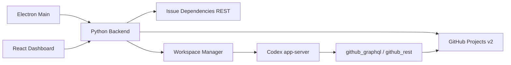

# Architecture

GitHub Symphony 是本地运行的 Codex 编排器。它不是 durable workflow engine；权威状态来自 GitHub Projects v2 和本地工作区。

## Runtime Flow

## Backend Layers

- `core`：不认识 GitHub 细节，只处理配置、prompt、事件、工作区、runner 和调度。
- `integrations.github`：把 Projects v2 item 归一化成 `WorkItem`，并实现 GitHub 动态工具。
- `codex`：封装 app-server JSON-RPC stdio 协议。
- `api`：向桌面端暴露本地 HTTP 控制面。

## Dispatch Rules

调度器每轮执行：

1. 刷新运行中任务状态。
2. 读取 active states 中的 Project items。
3. 按 priority、created_at、identifier 排序。
4. 跳过 running/claimed、terminal、阻塞 Todo、超过并发槽的任务。
5. 为可派发任务创建 runner。

## Recovery Model

服务重启后不读取数据库恢复；它重新读取 GitHub Project 和本地 workspace。这个模型简单，但意味着运行中 Codex 进程不会跨服务重启恢复，只会在下一轮 poll 中重新派发仍处于 active state 的任务。
